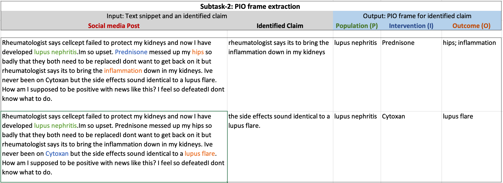

### Causal Claims Identification and PIO Frame Extraction  
The 17th International Workshop on Semantic Evaluation


## Motivation 
Identification and automatic verification of medical claims from unstructured user-generated text data is an onerous but essential step for various decision-making processes. Some day-to-day tasks that can benefit from automatic claim identification are content moderation, insurance claim identification, and hypothesis generation from clinical notes. 

Towards building this capability and motivating further research in this direction, we propose the following shared subtasks. 

## Task description:  

SemEval-2023 task 8 consists of two two sub-tasks. Subtask 1 focuses on the identification of causal claims, experience, etc. in a provided multi (or single) sentence text snippet and subtask 2 focuses on the extraction of the PIO frame related to identified causal claim in the provided text snippet. More details on each subtask are provided below.  


### Subtask 1: Causal claim identification:  

For the provided snippet of text, the first subtask aims to identify the span of text that is either a claim, experience, experience_based_claim or a question. These four categories can be defined as follow:  
- Claim: Commmunicates a causal interaction between an intervention and an outcome. 
- Experience: Relates a specific outcome/symptom to an intervention or population based on someone's experience. 
- Experience based claim: A claim based on someone's experince. 
- Question: Poses a question. 

<!-- 
In experience, the post communicated something an individual's experience but is not making a claim yet. Whereas in experience_based_claim, the post makes a claim based on an individual's experience. And in Claim category, the post makes a general claims.  -->

<!-- Following in an example for each category. 
- **Experince**: " I am left with headache after taking drug-B."
- **Experince_based_claim**: " I am left with headache after taking drug-B and I recently read few posts mentioning the same."
- **Claim**: " I have read literature reporting that Drug-A doesn't work for Condition-B." -->

Participants can work on it at sentence level and try to classify sentences in one of the given classes but many times claim (or other class) is just a part of the sentence. But this maybe only a baseline as in many examples only a part of sentence is annotated as one of these category. Please check the  image below for more clarity.   

   

----- 
### Subtask 2: PIO frame extraction:  

In this subtask, for a given multi (or single) sentence text snippet and identified claim in that snippet, the task is to extract related Population (P), Intervention (I), and Outcome (O) frame. While it is rare, it may be the case that there is more than one claim in any given post. In that case, we want to identify PIO elements for a given claim. This can be framed as a sequence tagging task.  


    

## Dataset details: 
We are currently providing a sample dataset and will be releasing the full training data soon. Our dataset is built from Reddit posts and to respect the users' privacy we are not releasing the dataset directly. Instead, we are only providing Reddit post ids, annotations, and a script. Participants can use the script to obtain the data and merge it with the provided annotations. If users choose to delete their post, the script won't be able to get it. 


### Sample dataset
For this task, we are providing reddit post ids, our annotations and a script to obtain the datset from reddit. Please go through following link to obtain the dataset: 
- [Sample training and test data](https://drive.google.com/drive/folders/1cN20UanW8GmrDo1YkeMP5_AGTZ_QOtlG?usp=sharing) for both the stage 
- [Python script](https://drive.google.com/file/d/10D5VKvdKcIJvtC47vE7IcQQl_2f9qvG4/view?usp=sharing) to download the actual posts 
- [Medium article](https://towardsdatascience.com/scraping-reddit-data-1c0af3040768) if you need help with reddit crediational require in the script   
 
 The dataset provided here is same as the dataset in Codalab page but participants will need to register to access the competition leatherboard.  

## CodaLab competition details: 
Visit our [Codalab](https://codalab.lisn.upsaclay.fr/competitions/6948?secret_key=0eb18fd8-c847-4738-956c-f0f19fe3692e) website for detailed instruction. The main task along with evalution leatherboard will be hosted on codaLab. Each participant will need to sign in and register for the task.   

### Submission  
We started the submission in January 2023 and participants used our  [CodaLab task page](https://codalab.lisn.upsaclay.fr/competitions/6948?secret_key=0eb18fd8-c847-4738-956c-f0f19fe3692e).

## Leaderboard  
**Note on Evaluations**: We required test files for both submissions to be labelled at the token ("word") level since our annotations were effectively text spans for stage-1 and individual tokens for stage-2. For stage-1, we evaluated macro-averaged F-1 scores across five classes - `claims`, `personal experiences`, `claims based on personal experiences`, `questions`, and `other`. These classes were evaluated at the `sentence` level as opposed to **exact** spans/tokens since differences in annotated spans often depend on  differences in where annotators *(and consequently, your trained models)* decide to *mark* span boundaries, and sentences covering those spans can reasonably be inferred to belonging to a given/same class. For stage-2 i.e. PIO tagging, we evaluate at the token-level individually (effectively treating it as an entity-tagging task) for `populations`, `interventions`, and `outcome`. We provide independent metrics (F-1) across these three classes since a majority of tokens in any reddit post do not belong to either of these classes (hence, making this classification substantially more difficult). 

We will reach out to you only if **ALL** of your test file submissions failed in their entirety (due to formatting issues or otherwise), and we were unable to fix them. So as long as at least one of your submitted test files passed formatting checks, they have been accounted for. 

**Note on Test-File Names & Additional Metrics**: We received an average of 7 test submissions per participant. Most of you submitted multiple test files (CSVs) with the same name, so in case you wish to know metrics specific to a test submission (either for your writing, or otherwise), please reach to us with the date/time/name of the submission (from Codalab) and we will do our best to provide you with additional details. 


### SubTask-1 / Stage-1 

|Team |          UserId<br>(From Codalab)          	|   P   	|   R   	|  F-1  	|
|:---:|:------------------------------------------:	|:-----:	|:-----:	|:-----:	|
|MaChAmp| robvanderg                                 	| 78.14 	| 78.65 	| 78.40 	|
|NCUEE-NLP| yhcheng_ncu, jenhaoyang, lhlee (NCUEE-NLP) 	| 72.97 	| 67.36 	| 70.05 	|
|MasonNLP | gramacha                                   	| 71.16 	| 65.78 	| 68.59 	|
|HEVS-TUW     | wojciechkusa                               	| 68.73 	| 62.90 	| 65.70 	|
|---    | anthonyhughes                              	| 70.24 	| 58.37 	| 63.76 	|
|CAISA     | aka                                        	| 60.68 	| 55.71 	| 58.09 	|
|Togedemaru| dinosaph                                   	| 34.93 	| 31.14 	| 32.93 	|


### SubTask-2 / Stage-2
|Team|          UserId<br>(From Codalab)          	| F-1<br>(POP) 	| F-1<br>(INT) 	| F-1<br>(OUT) 	|
|:---:|:------------------------------------------:	|:------------:	|:------------:	|:------------:	|
|MaChAmp| robvanderg                                 	|     40.55    	|     49.71    	|     30.08    	|
|NCUEE-NLP| yhcheng_ncu, jenhaoyang, lhlee (NCUEE-NLP) 	|     37.78    	|     43.58    	|     30.67    	|
|MasonNLP | gramacha                                   	|     34.96    	|     42.16    	|     20.83    	|
|---| anthonyhughes                              	|     32.22    	|     41.29    	|     23.75    	|
|HEVS-TUW | wojciechkusa                               	|     17.44    	|     26.39    	|     22.78    	|
|CAISA | aka                                        	|     17.67    	|     21.05    	|     20.31    	|

<br/><br/> 
**Note:** All participants are required to submit a [system paper](https://semeval.github.io/system-paper-template.html).


## Paper 
[Semeval-2023 Task 8 - Paper](https://aclanthology.org/2023.semeval-1.311.pdf)
```
@InProceedings{khetan-EtAl:2023:SemEval,
  author    = {Khetan, Vivek and Wadhwa, Somin and Wallace, Byron and Amir, Silvio},
  title     = {SemEval-2023 Task 8: Causal medical claim identification and related PIO frame extraction from social media posts},
  booktitle      = {Proceedings of the 17th International Workshop on Semantic Evaluation},
  month          = {July},
  year           = {2023},
  address        = {Toronto, Canada},
  publisher      = {Association for Computational Linguistics},
}

````
----------
### Important dates for task participants

- [x] Training data ready and available on our [CodaLab task page](https://codalab.lisn.upsaclay.fr/competitions/6948?secret_key=0eb18fd8-c847-4738-956c-f0f19fe3692e)
- [x] Evaluation start 10 January 2023 
- [x] Evaluation end by 31 January 2023
- [x] Paper submission due February 2023 - each team will submit a [system paper](https://semeval.github.io/system-paper-template.html)
- [x] Notification to authors March 2023
- [x] Camera ready paper due 24th April 2023
- [x] SemEval workshop Summer 2023 at ACL Toronto

All deadlines are 23:59 UTC-12 (["anywhere on Earth"](https://en.wikipedia.org/wiki/Anywhere_on_Earth)).

### Related resouces
- [Frequenty Asked Questions](https://semeval.github.io/faq.html)
- [Paper Submission Requirements](https://semeval.github.io/paper-requirements.html)
- [Guidelines for SemEval System Paper](https://semeval.github.io/system-paper-template.html)

## Organizers
- Vivek Khetan, Accenture Labs
- Somin Wadhwa, Northeastern University 
- Silvio Amir, Northeastern University
- Byron C. Wallace, Northeastern University


Contact us on:

- Email us: *semeval23.causalclaims@proton.me* 


<!---
some commented files - we can add our new md files and hyperlink here if needed
### Resources

- [Frequently Asked Questions about SemEval](/faq.html)
- [Paper Submission Requirements](/paper-requirements.html)
- [Guidelines for Writing Papers](/system-paper-template.html)
- [SemEval-2023 call for task proposals (archival)](cft)
--->

<!-- ### Sponsorship

SemEval is sponsored by the [SIGLEX](http://alt.qcri.org/siglex/) Special Interest Group on the Lexicon of the Association for Computational Linguistics.

 -->
 
<!-- __Contact:__ <semevalorganizers@gmail.com> -->
<!--- Most questions not answered by the above resources should be directed to organizers of specific [tasks](tasks.html).
General questions about SemEval organization should be directed to <semevalorganizers@gmail.com>.--->

## Anti-Harassment policy

SemEval highly values the open exchange of ideas, freedom of thought and expression, and respectful scientific debate.
We support and uphold the [ACL Anti-Harassment policy](https://www.aclweb.org/adminwiki/index.php?title=Anti-Harassment_Policy).
Participants are encouraged to send any concerns or questions to the [Professional Conduct Committee](https://www.aclweb.org/adminwiki/index.php?title=Professional_Conduct_Committee),
[Priscilla Rasmussen](mailto:acl@aclweb.org) and/or the workshop organizers.
