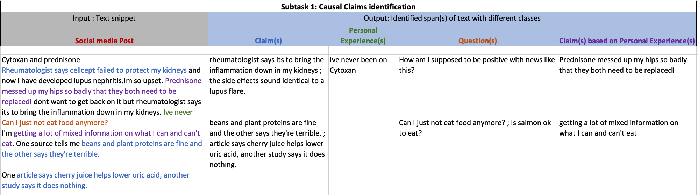

Welcome to the [SemEval](https://semeval.github.io/)-2023 task 8 
### Causal Medical claim identification and related PICO frame extraction 
## Motivation 
Identification and automatic verification of medical claims from unstructured user generated text data is an onerous but essential step for various various decision making process - including but not limited to content moderation, insurance claim identification, identification of novel condition-treatment from scientiific litereture as well as hypothesis generation from clinical notes.  

Towards building this capability, we propose following shared subtasks. 

## Task description:  

Our shared task has two sub-tasks. Subtask 1 focuses on the identification of causal claims in a provided multi (or single) sentence text snippet and subtask 2 focuses on the extraction of the PIO frame related to identified causal claim in the provided text snippet. More details on each subtask are provided below. 

### Subtask 1: Causal claim identification:  

For the provided snippet of text, the first subtask aims to identify the span of text that is claim, question, or experience. It is sequence tagging task, i.e., a span of text can be someone's experience as well as a claim. Participants can work on it at sentence level try to classify sentences in one of the given classes but many times claim (or other class) is just a part of the sentence.  

   

### Subtask 2: PIO frame extraction:  

In this subtask, for a given multi (or single) sentence text snippet and identified claim in that snippet, the task is to extract related Population (P), Intervention (I), and Outcome (O) frame. While it is rare, it may be the case that there is more than one claim in any given post. In that case, we want to identify PIO elements for a given claim. This can be framed as a sequence tagging task.  

    

### Competition page and dataset:  
Visit our [Codalab](https://codalab.lisn.upsaclay.fr/competitions/6284?secret_key=effe6a1c-447e-4407-9085-e2168f92d4ea#learn_the_details-evaluation) website for more instruction and access to the sample dataset.   
  
### Sample dataset
 To obtain the dataset - you will need to folow the steps given in the provided script on this [Google Drive link](https://drive.google.com/drive/folders/16SI3MlOyOLflVIeYkAUDTKJLuwerZ4Zj?usp=sharing) . We are only giving reddit post ids along with our annotations. The task participants can use the provided script to obtain the dataset. Please go to [this medium post](https://towardsdatascience.com/scraping-reddit-data-1c0af3040768) if you have need help with creation on reddit credential needed in the script. Also read about argeparse library as it is needed for the provided script.  
 
 The dataset provided here is same as the dataset in Codalab page but participants will need to join the competition.  
  
### Evaluation 
We will evaluate submissions on class-wise F1 scores (macro-averaged for leaderboard).

### Important dates for task participants

- Tasks announced (with sample data available): 15 July 2022
- Training data ready 1 September 2022
- Evaluation start 10 January 2023
- Evaluation end by 31 January 2023 (latest date; task organizers may choose an earlier date)
- Paper submission due February 2023
- Notification to authors March 2023
- Camera ready due April 2023
- SemEval workshop Summer 2023 (co-located with a major NLP conference)

All deadlines are 23:59 UTC-12 (["anywhere on Earth"](https://en.wikipedia.org/wiki/Anywhere_on_Earth)).

### Organizers
Contact us on [Google group](causal_claims@googlegroups.com)  

<!---
some commented files - we can add our new md files and hyperlink here if needed
### Resources

- [Frequently Asked Questions about SemEval](/faq.html)
- [Paper Submission Requirements](/paper-requirements.html)
- [Guidelines for Writing Papers](/system-paper-template.html)
- [SemEval-2023 call for task proposals (archival)](cft)
--->

### Sponsorship

SemEval is sponsored by the [SIGLEX](http://alt.qcri.org/siglex/) Special Interest Group on the Lexicon of the Association for Computational Linguistics.

__Contact:__ <semevalorganizers@gmail.com>
<!--- Most questions not answered by the above resources should be directed to organizers of specific [tasks](tasks.html).
General questions about SemEval organization should be directed to <semevalorganizers@gmail.com>.--->

## Anti-Harassment policy

SemEval highly values the open exchange of ideas, freedom of thought and expression, and respectful scientific debate.
We support and uphold the [ACL Anti-Harassment policy](https://www.aclweb.org/adminwiki/index.php?title=Anti-Harassment_Policy).
Participants are encouraged to send any concerns or questions to the [Professional Conduct Committee](https://www.aclweb.org/adminwiki/index.php?title=Professional_Conduct_Committee),
[Priscilla Rasmussen](mailto:acl@aclweb.org) and/or the workshop organizers.
